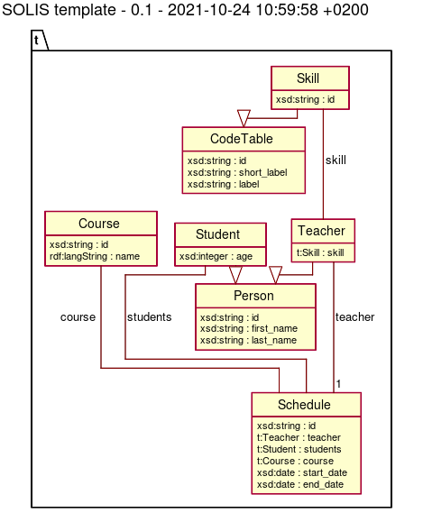

# Solis

Solis means 'the sun' in Latin or just Silos spelled backwards. 
A simple idea to use SHACL to describe models and API on top of a data store.

# Status
Although I'm using it in production I must shamefully acknowledge that it actually needs refactoring. Solis is currently still grown organically driven by my needs and understanding of problem domain(RDF, triples, ...).
When my current project is live I'll start to refactor the code and release it as 1.0.

# From Google Sheets to RDF, Shacl, ... to API
The biggest hurdle when developing a model is the communication between the people who know the problem domain and the developers. 
Next to this every change in the model has a direct impact on everything that uses the model. From migrations to documentation and eventually the API.
This is an effort to streamline and minimalize this impact.

## config.yml
Config file contains all the options needed to run Solis.

```yaml
:debug: false
:key: your_Google_API_key
:solis:
    :cache: tmp/cache
    :query_cache_expire: 300
    :shacl: /path/to/t_shacl.ttl
    :env:
        :graph_name: https://t.example.com/
        :graph_prefix: t
        :sparql_endpoint: http://127.0.0.1:8890/sparql
        :inflections: /path/to/t.json
        :language: nl
:sheets:  
  :t: 1vi2U9Gpgu9mA6OpvrDBWRg8oVKs6Es63VyLDIKFNWYM  

```

- debug: extra logging like generated queries etc.
- key: Google API key used to read a Google Sheet
- solis: runtime configuration
  - cache: Google Sheets can be cached to minimize Google API calls
  - query_cache_expire: time construct queries should expire. 0 is never expire
  - shacl: location of the shacl file to use
  - env: shacl info
    - graph_name: uri of the graph
    - graph_prefix: uri prefix of the graph
    - sparql_endpoint: uri to connect to the data store. Currently focus is on triple stores
    - inflections: singular, plural mapping file for multi lingual data models
    - language: default language strings are stored in.
- sheets: list of models
  - t: an example sheet
  
## Solis Model Template



This is simple template exclusively used for testing.
### Google Sheet [model](https://docs.google.com/spreadsheets/d/1vi2U9Gpgu9mA6OpvrDBWRg8oVKs6Es63VyLDIKFNWYM/edit#gid=577648221)

#### Tabs
- _PREFIXES: a list of ontologies and prefixes used
  - Base: All entities defined under this URI. Selected by '*'
  - Prefix: prefix of ontology
  - URI: URI of ontology
- _METADATA: description fields for metadata
  - key: identifier of metadata
  - value: metadata value
- _ENTITIES: a list of entities(classes) used in the model
  - Name: name of entity
  - NamePlural: plural name of entity. The generated API has RESTful endpoints. Non english entities are incorrectly pluralized
  - Description: purpose of entity
  - subClassOf: internal entity reference. Entity you want to inherit from 
  - sameAs: External entity reference (not activily used, yet)
- Any number of tabs describing properties of an entity. See below  

#### Entity tabs
Not every entity described in _ENTITIES needs a tab. 
##### CodeTable
This is a base entity were other entities that fit a code table are inherited from

| Name | Description | Min | Max | sameAs | datatype |
|---|---|---|---|---|---|
| id | unique record identifier | 1 | 1 | schema:identifier | xsd:string |
|short_label|lookup key, short label|0|1|xsd:string|
|label|prefered display label|1|1|xsd:string|

##### Skill
Inherits from CodeTable no tab is needed. Skills a teacher can teach
```json
[
  { "id": 1, "short_label": "problemsolv", "label": "Applying and problem-solving"},
  { "id": 2, "short_label": "commexp", "label": "Communicating and expressing"},
  { "id": 3, "short_label": "intcon", "label": "Integrating and connecting"},
  { "id": 4, "label": "Reasoning"}
]
```

##### Person
Base class for a person

| Name | Description | Min | Max | sameAs | datatype |
|---|---|---|---|---|---|
| id | unique record identifier | 1 | 1 | schema:identifier | xsd:string |
|first_name|Person's first name|1|1|schema:givenName|xsd:string|
|first_name|Person's last name|1|1|schema:familyName|xsd:string|

##### Teacher
Inherits all fields from Person and adds extra property "skill" an extra tab with the extra properties must exist 

| Name | Description | Min | Max | sameAs | datatype |
|---|---|---|---|---|---|
| id | unique record identifier | 1 | 1 | schema:identifier | xsd:string |
|skill|field teacher is skilled in|1| | |t:Skill|

##### Student
Inherits all fields from Person and adds extra property "age" an extra tab with the extra properties must exist

| Name | Description | Min | Max | sameAs | datatype |
|---|---|---|---|---|---|
| id | unique record identifier | 1 | 1 | schema:identifier | xsd:string |
|age|age of student|1|1| |xsd:integer|

```json
[
  {"id":  "s1", "first_name":  "Jane", "last_name":  "Smith", "age":  22},
  {"id":  "s1", "first_name":  "Gino", "last_name":  "Santi", "age":  25}
]
```

##### Course 
| Name | Description | Min | Max | sameAs | datatype |
|---|---|---|---|---|---|
| id | unique record identifier | 1 | 1 | schema:identifier | xsd:string |
|name|name of a course|1|1| |xsd:string|

##### Schedule
| Name | Description | Min | Max | sameAs | datatype |
|---|---|---|---|---|---|
| id | unique record identifier | 1 | 1 | schema:identifier | xsd:string |
|teacher|schedule belongs to|1|	1| |t:Teacher|
|course|course within schedule| |1 | |t:Course|
|start_date| |1|1| |xsd:date|
|end_date|	|1|	1| |xsd:date|

##### Example data

When __no__ id is supplied records will be created and an id will be assigned
This example will create a schedule, teacher and course record. The skill and student records are referenced by id and must exist.
```json
{
  "type": "schedules",
  "attributes": {
    "teacher": {
      "first_name": "John",
      "last_mame": "Doe",
      "skill": [{"id":  "1"}, {"id":  "2"}]
    },
    "students": [{"id": "s1"}, {"id": "s2"}],
    "course": {
      "name": "Something 101"
    },
    "start_date": "2021-10-01",
    "end_date": "2022-01-01"
  }
}
```

Create schedule with existing teacher and course records
```json
{
  "type": "schedules",
  "attributes": {
    "teacher": {
      "id": "1"
    },
    "course": {
      "id": "A23B-101"
    },
    "start_date": "2021-10-01",
    "end_date": "2022-01-01"
  }
}
```

## Solis API
### Solis::ConfigFile
Static class to read and manipulate config.yml file
- name=: name of config file defaults to config.yml
- path=: location of config file defaults to ./config.yml or ./config/config.yml
- [key]=: lookup or set a key in your config file
- include?(key): is key available in config file

```ruby
Solis::ConfigFile.path='/path/to/config/file'
raise ':key not found' unless Solis::ConfigFile.include?(:key)

key = Solis::Configfile[:key]
```

### Solis::LOGGER
Logger class defaults to STDOUT for now

TODO: check if this needs to be configurable

### Solis::VERSION
Returns Solis version number 

### Solis::Error
List of Solis errors

##### Solis::Error::GeneralError
An unknown error
##### Solis::Error::InvalidAttributeError
Attribute error. Happens when data does not match model 
##### Solis::Error::NotFoundError
When query returns not found

### Solis::Graph
### Solis::Model
### Solis::Resource
### Solis::Query
### Solis::Shape

### Solis::Shape::Reader
#### Solis::Shape::Reader::File
#### Solis::Shape::Reader::Sheet

### Setup Solis
``` ruby
Solis::ConfigFile.path = './'
solis = Solis::Graph.new(Solis::Shape::Reader::File.read(Solis::ConfigFile[:solis][:shacl]), Solis::ConfigFile[:solis][:env])
```


TODO:
 - extract sparql layer into its own gem

## Installation

Add this line to your application's Gemfile:

```ruby
gem 'solis'
```

And then execute:

    $ bundle install

Or install it yourself as:

    $ gem install solis

## Usage

Transforming a Google Sheet into a SHACL file and Entity model.

[Google sheet template](https://docs.google.com/spreadsheets/d/1vi2U9Gpgu9mA6OpvrDBWRg8oVKs6Es63VyLDIKFNWYM/edit?usp=drive_web&ouid=105856802847127219255) example

Tabs starting with an underscore define general metadata 
    - _PREFIXES: ontologies to include in SHACL file
    - _METADATA: key/value pairs describing the ontology
    - _ENTITIES: a list of entities describing if it is a sub class of or same as an external entity

Every entity that is referenced in _ENTITIES can be further described in its own tab.


TODO: Write usage instructions here

## Development

After checking out the repo, run `bin/setup` to install dependencies. Then, run `rake test` to run the tests. You can also run `bin/console` for an interactive prompt that will allow you to experiment.

To install this gem onto your local machine, run `bundle exec rake install`. To release a new version, update the version number in `version.rb`, and then run `bundle exec rake release`, which will create a git tag for the version, push git commits and tags, and push the `.gem` file to [rubygems.org](https://rubygems.org).

## Contributing

Bug reports and pull requests are welcome on GitHub at https://github.com/[USERNAME]/solis. This project is intended to be a safe, welcoming space for collaboration, and contributors are expected to adhere to the [code of conduct](https://github.com/[USERNAME]/solis/blob/master/CODE_OF_CONDUCT.md).


## License

The gem is available as open source under the terms of the [MIT License](https://opensource.org/licenses/MIT).

## Code of Conduct

Everyone interacting in the Solis project's codebases, issue trackers, chat rooms and mailing lists is expected to follow the [code of conduct](https://github.com/[USERNAME]/solis/blob/master/CODE_OF_CONDUCT.md).
